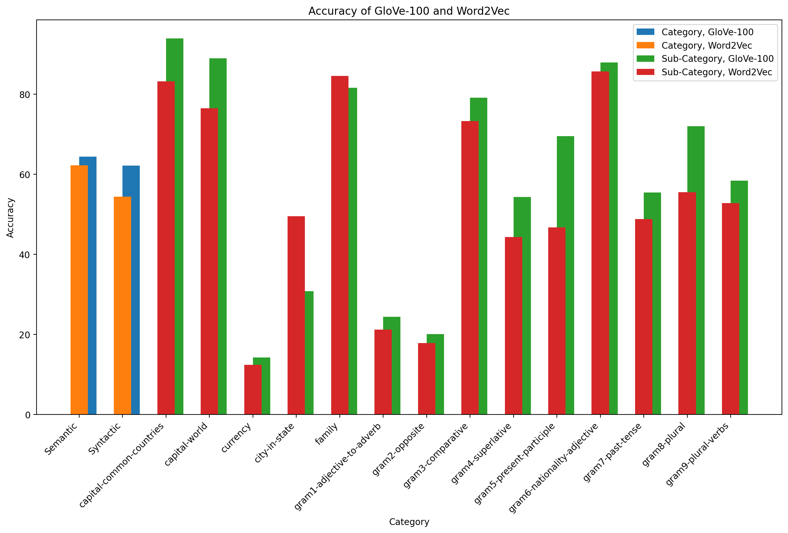
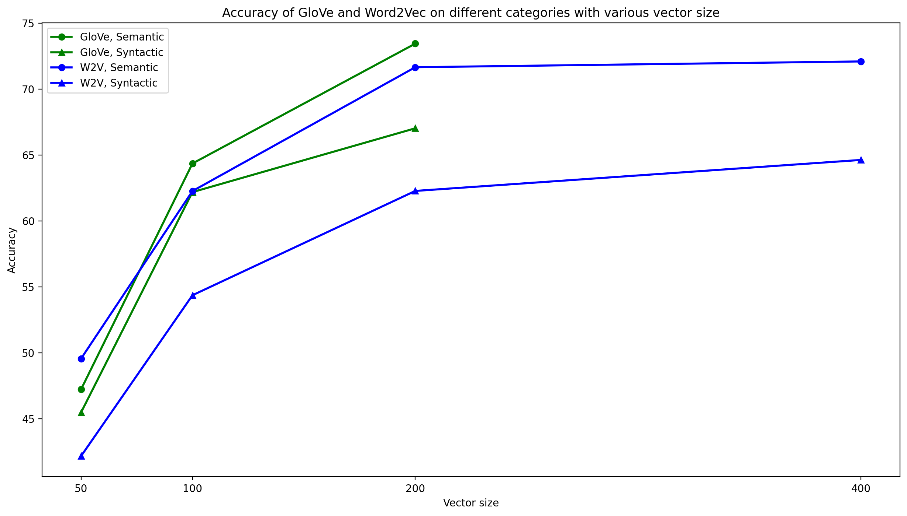
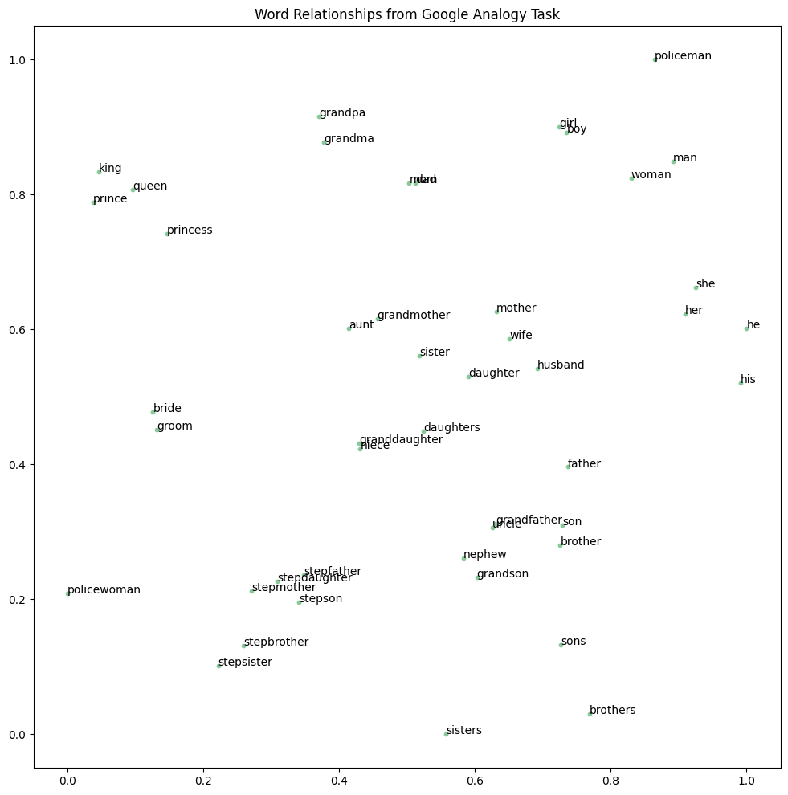

# CS563100 Natural Language Processing - Assignment 1: Word Analogy

## Experimental Setup

**Running Environment:**
* **System:** Ubuntu 20.04.5 LTS
* **CPU:** Intel(R) Core(TM) i9-9820X CPU @ 3.30GHz
* **Python Version:** 3.8.10

**Experiments:**

* **Embedding Models:** Evaluated GloVe models ('glove-wiki-gigaword-50', 'glove-wiki-gigaword-100', 'glove-wiki-gigaword-200') and a custom Word2Vec model.

* **Pre-processing:**
    * Non-English word removal (using `nltk.wordpunct_tokenize`).
    * Stop word removal (using `gensim.parsing.preprocessing.remove_stopwords()`).
    * Lemmatization (using `nltk.stem.WordNetLemmatizer.wnl().morphy()`).
    * Dictionary size control via `min_count` parameter in `gensim.models.Word2Vec`.

* **Hyperparameter Settings (Custom Word2Vec):**
    * `vector_size=100`
    * `window=5`
    * `min_count=3`
    * `workers=4`
    * Other parameters set to default.

## Performance Analysis by Category and Sub-category

Fig. 1 illustrates the accuracy of GloVe-100 and custom Word2Vec (20% sampling) across various semantic and syntactic categories and sub-categories. Performance trends are similar between the models. Custom Word2Vec generally underperforms GloVe-100, except for a notable outperformance in the `city-in-state` sub-category. This suggests the sampled data might have provided better contextual information for city-state relationships for the custom model, or that GloVe-100's fixed dimensionality was less suitable for representing this category effectively (as evidenced by GloVe-200's improved performance in Table II).

Both models exhibited low performance in `Semantic-currency`, `Syntactic-gram1` (adjective-to-adverb), and `Syntactic-gram2` (opposite). The poor performance in `currency` is likely due to limited relevant training data. For `gram1`, a character-level model might be more appropriate given the morphological nature of the task. The low accuracy in `gram2` could be attributed to the removal of negation words (e.g., "not") during pre-processing, hindering the learning of antonymous relationships.

**Fig. 1:** Accuracy of GloVe-100 and custom Word2Vec (sampled 20%) in every category and sub-category.

## Primary Factor Affecting Accuracy

Table II indicates a positive correlation between training data sampling rate and accuracy for the custom Word2Vec model. However, Table I and Fig. 2 highlight the significant impact of the embedding dimensionality (`vector_size`). Increasing `vector_size` led to substantial accuracy gains, with diminishing returns at higher dimensions. This suggests that `vector_size` was a primary factor influencing model performance in these experiments. Conversely, increasing `min_count` could negatively impact generalization by discarding potentially valuable low-frequency words. Furthermore, the superior pre-processing applied to the training data of pre-trained models like GloVe likely contributes to their strong performance.

**Fig. 2:** Accuracy of GloVe-100 and custom Word2Vec (sampled 20%) in two categories with various vector sizes.

**Table I:** Testing on different hyperparameter settings.
|         | Pretrained GloVe 100 | Pretrained GloVe 200 | Custom w2v sampled 20% | Custom w2v sampled 20% | Custom w2v sampled 20% | Custom w2v sampled 20% | Custom w2v sampled 20% | Custom w2v sampled 20% |
|-----------------------|----------------------|----------------------|------------------------|------------------------|------------------------|------------------------|------------------------|------------------------|
| min_count             | -      | -      | 3        | 5        | 10       | 3        | 3        | 3        |
| vector_size           | -      | -      | 100      | 100      | 100      | 50       | 200      | 400      |
| **Category** |        |        |          |          |  |          |          |          |
| Semantic| 64.35% | **73.44%** | 62.26%   | 62.23%   | 61.9%    | 49.55%   | 71.65% | **72.09%** |
| Syntactic             | 62.18% | **67.02%** | 54.36%   | 54.21%   | 53.56%   | 42.16%   | 62.27% | **64.62%** |
| **Sub-Category** |        |        |          | |          |          |          |          |
| capital-common-countries | 93.87% | **94.66%** | 83.2%    | 81.23%   | 79.64%   | 73.32%   | 89.33% | **90.32%** |
| capital-world         | 88.95% | **94.63%** | 76.44%   | 76.81%   | 76.55%   | 66.22%   | 83.62%   | 83.4%    |
| currency| 14.2%  | **17.21%** | 12.36%   | 13.39%   | 12.59%   | 8.08%    | 17.21% | **18.94%** |
| city-in-state         | 30.81% | **49.98%** | 49.49%   | 48.72%   | 48.72%   | 28.66%   | 65.18% | **66.27%** |
| family  | 81.62% | **85.57%** | 84.58%   | 84.39%   | 82.41%   | 77.08%   | **91.9%** | 88.34%   |
| gram1 adjective-to-adverb | 24.4%  | **25.4%** | 21.17%   | 21.07%   | 20.46%   | 12.9%    | 23.29%   | 20.56%   |
| gram2 opposite        | 20.07% | **22.66%** | 17.86%   | 17.86%   | 17.0%    | 12.07%   | 24.63% | **29.8%** |
| gram3 comparative     | 79.13% | **86.49%** | 73.27%   | 72.82%   | 71.47%   | 59.01%   | 83.03% | **87.54%** |
| gram4 superlative     | 54.28% | **69.79%** | 44.3%    | 43.49%   | 42.96%   | 27.63%   | 50.89%   | 52.85%   |
| gram5 present participle | **69.51%** | 68.28% | 46.69%   | 43.66%   | 43.09%   | 29.07%   | 58.43%   | 58.9%    |
| gram6 nationality adjective | 87.87% | **92.5%** | 85.68%   | 85.05%   | 84.87%   | 79.61%   | 86.93%   | 87.24%   |
| gram7 past-tense      | 55.45% | **60.19%** | 48.78%   | 50.71%   | 50.45%   | 35.38%   | 58.65% | **62.82%** |
| gram8 plural          | 72.0%  | **77.4%** | 55.48%   | 56.23%   | 54.5%    | 40.24%   | 69.22% | **74.77%** |
| gram9 plural-verbs    | 58.39% | **59.77%** | 52.76%   | 52.99%   | 54.14%   | 38.39%   | 62.64% | **66.67%** |

## Insights from t-SNE Visualization

The t-SNE plots (Fig. 3 and Fig. 4) demonstrate that both GloVe-100 and custom Word2Vec effectively group semantically related words. For instance, family terms (mother, father, daughter, son) cluster together, indicating the models captured their semantic proximity. Words sharing similar contexts in the training data also appear close in the embedding space (e.g., king, queen, prince, princess). Gender distinctions are also evident in the clustering of terms like man/woman and he/her.

Interestingly, the custom Word2Vec visualization successfully grouped "policeman" and "policewoman," while GloVe-100 did not. This suggests that the custom model might have developed a stronger understanding of role-based semantic relationships.

**Fig. 3:** The t-SNE visualization plot of the pretrained GloVe-100 model.

**Fig. 4:** The t-SNE visualization plot of the custom Word2Vec model.

## Impact of Increased Training Data

Increasing the training data (higher sample rate) generally leads to better word representations. Higher frequency and wider contextual exposure allow the model to capture more nuanced word meanings and relationships, potentially improving generalization. However, the computational cost of significantly increasing training data in NLP tasks is substantial. More efficient training strategies, such as active learning, should be considered for optimal data utilization.

**Table II:** Testing on different pretrained GloVe weights and custom Word2Vec models on various sample rates.
|         | Pretrained GloVe 50 | Pretrained GloVe 100 | Pretrained GloVe 200 | Custom w2v sampled 15% | Custom w2v sampled 20% | Custom w2v sampled 25% | Custom w2v sampled 30% | Custom w2v sampled 35% |
|-----------------------|----------------------|----------------------|----------------------|------------------------|------------------------|------------------------|------------------------|------------------------|
| **Category** |        |        |        |          |          |          |          |          |
| Semantic| 47.22% | 64.35% | **73.44%** | 62.49%   | 62.26%   | 62.97%   | 64.27%   | **64.52%** |
| Syntactic             | 45.47% | 62.18% | **67.02%** | 53.66%   | 54.36%   | 54.9%    | 54.85%   | **55.19%** |
| **Sub-Category** |        |        |        |          |          |          |          |          |
| capital-common-countries | 79.25% | 93.87% | **94.66%** | 83.2%    | 83.2%    | 81.82%   | 81.03%   | 81.23%   |
| capital-world         | 68.48% | 88.95% | **94.63%** | 77.06%   | 76.44%   | 77.81%   | **79.38%** | 79.05%   |
| currency| 8.31%  | 14.2%  | **17.21%** | 11.55%   | 12.36%   | 12.36%   | **13.28%** | 11.66%   |
| city-in-state         | 15.32% | 30.81% | **49.98%** | 49.41%   | 49.49%   | 49.66%   | 51.03% | **53.02%** |
| family  | 68.97% | 81.62% | **85.57%** | 82.61%   | 84.58%   | **86.96%** | 86.76%   | 85.77%   |
| gram1 adjective-to-adverb | 15.22% | 24.4%  | **25.4%** | 20.16%   | 21.17%   | 18.95%   | **22.28%** | 21.57%   |
| gram2 opposite        | 9.48%  | 20.07% | **22.66%** | 17.0%    | 17.86%   | 18.84%   | **20.57%** | 19.7%    |
| gram3 comparative     | 51.8%  | 79.13% | **86.49%** | 70.2%    | 73.27%   | **75.3%** | 71.47%   | 72.52%   |
| gram4 superlative     | 28.61% | 54.28% | **69.79%** | 42.96%   | 44.3%    | 43.67%   | **44.56%** | 41.18%   |
| gram5 present participle | 41.57% | **69.51%** | 68.28% | 46.31%   | 46.69%   | 44.79%   | 46.4%    | **48.86%** |
| gram6 nationality adjective | 85.99% | 87.87% | **92.5%** | 84.55% | **85.68%** | 85.12% | 84.37%   | 84.18%   |
| gram7 past-tense      | 37.5%  | 55.45% | **60.19%** | 50.38%   | 48.78%   | 50.26%   | 49.68%   | **50.9%** |
| gram8 plural          | 59.91% | 72.0%  | **77.4%** | 55.26%   | 55.48%   | 57.58%   | 58.63%   | **60.21%** |
| gram9 plural-verbs    | 34.37% | 58.39% | **59.77%** | 53.33%   | 52.76%   | **55.06%** | 52.76%   | 54.83%   |

## Reference

Sample code / Data: [IKMLab Github](https://github.com/IKMLab/NTHU_Natural_Language_Processing/tree/main/Assignments/Assignment1)
