# CS563100 Natural Language Processing - Assignment 2: Arithmetic as a Language

## Experimental Setup

**Running Environment:**
* **System:** Ubuntu 20.04.5 LTS
* **CPU:** Intel(R) Core(TM) i9-9820X CPU @ 3.30GHz
* **GPU:** RTX4080S
* **Python Version:** 3.8.10

## Experiments

### Impact of Learning Rate on Model Training

Experiments with Adam optimizers (learning rates: 1e-3, 5e-4, 5e-3, 1e-2) showed that smaller learning rates (1e-3, 5e-4) resulted in stable accuracy increases (Fig. 1 & 2). Conversely, larger learning rates (5e-3, 1e-2) led to poorer performance and instability, particularly with a learning rate of 1e-2 exhibiting significant accuracy and loss fluctuations, confirming the sensitivity of training to excessively high initial learning rates.

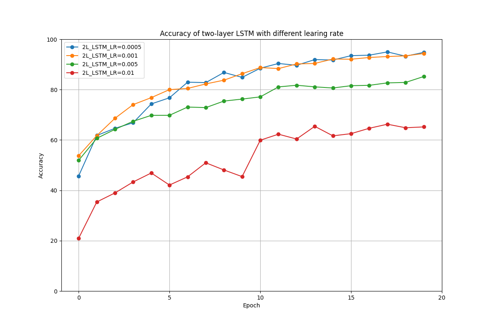

**Figure 1.** Accuracy of a two-layer LSTM with different learning rates.

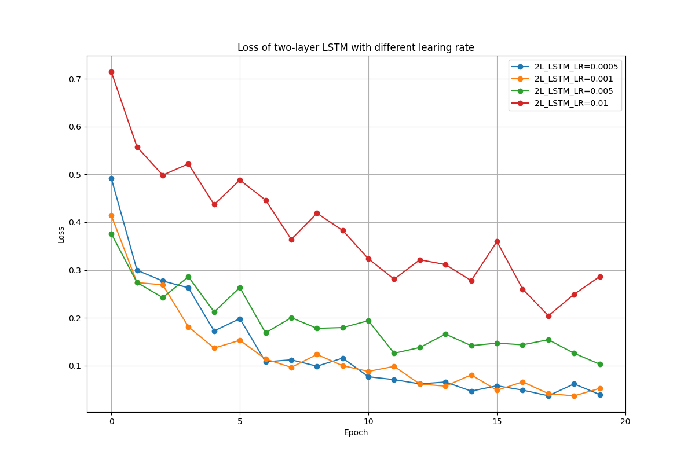

**Figure 2.** Loss of a two-layer LSTM with different learning rates.

### Comparison of RNN, GRU, and LSTM for Answer Generation

Evaluation of RNN, GRU, and LSTM models trained for 20 epochs on varying data sampling rates (20%, 40%, 60%, 80%, 100%) revealed the limitations of RNN for this arithmetic task, achieving a maximum validation accuracy below 40% even with the full dataset (Fig. 3 & 4). GRU and LSTM demonstrated superior performance, with validation accuracy improving with increased sampling rates and converging at similar high levels when trained on the complete dataset. While LSTM generally exhibited slightly better accuracy than GRU, the computationally less complex GRU presents a viable alternative.

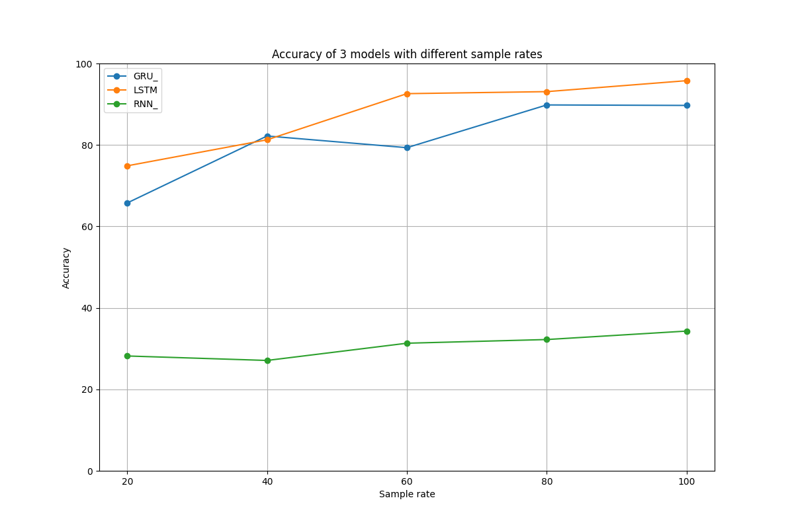

**Figure 3.** Accuracy of 3 different models in different sample rates with 20 epochs.

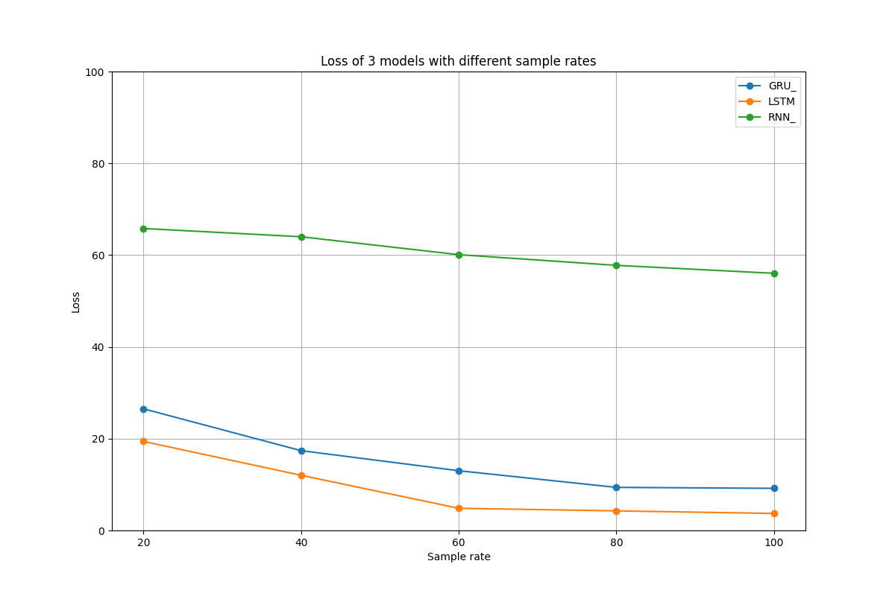

**Figure 4.** Loss of 3 different models in different sample rates with 20 epochs.

### Impact of Out-of-Distribution Evaluation Data (Three-Digit Numbers)

Testing a two-layer LSTM trained on two-digit arithmetic with a validation set containing three-digit numbers (prefixed with '100+') showed that despite continued training loss reduction, validation accuracy stagnated (Fig. 5 & 6). This indicates poor generalization to data outside the training distribution, suggesting that extending the training set to cover all three-digit combinations would be computationally expensive.

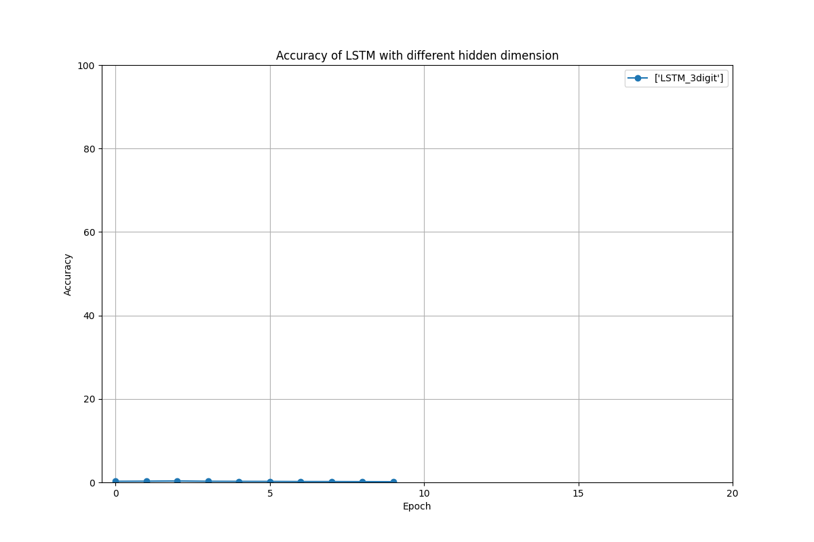

**Figure 5.** Accuracy of a two-layer LSTM with three-digit validation data.

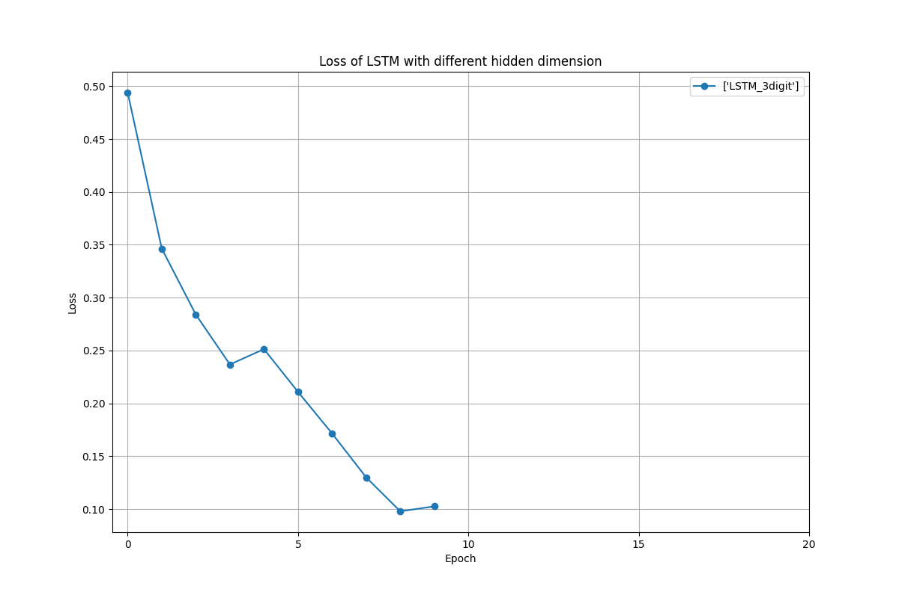

**Figure 6.** Loss of a two-layer LSTM with three-digit validation data.

### Answer Generation with Numbers Not in Training Data

Generating answers for arithmetic expressions containing numbers absent from the training data (e.g., '51+1=', '51\*1=', '51-1=', '100+1=') consistently yielded incorrect results. Similarly, malformed arithmetic expressions (e.g., '1+=', '2+=') also produced seemingly arbitrary outputs. Future work could explore training the model to identify and flag such invalid inputs by including negative examples in the training data.

### Necessity of Gradient Clipping During Training

Gradient clipping (both `clip_grad_value` and `clip_grad_norm`) helps prevent gradient explosion in deep neural networks, which can lead to unstable training and poor convergence. While all tested methods (no clipping, `clip_grad_value`, `clip_grad_norm`) eventually converged, the absence of gradient clipping resulted in a significant accuracy drop at epoch 10 (Fig. 8 & 9). `clip_grad_value` also exhibited a drop at epoch 15, whereas `clip_grad_norm` demonstrated a more stable accuracy increase throughout training.

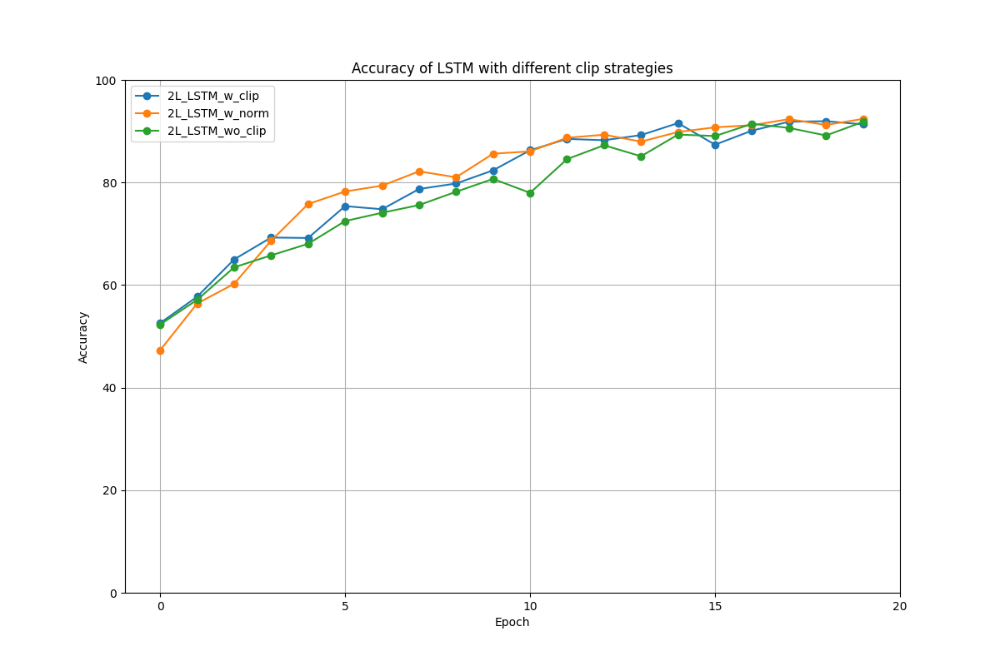

**Figure 8.** Accuracy of a two-layer LSTM with different learning rates.

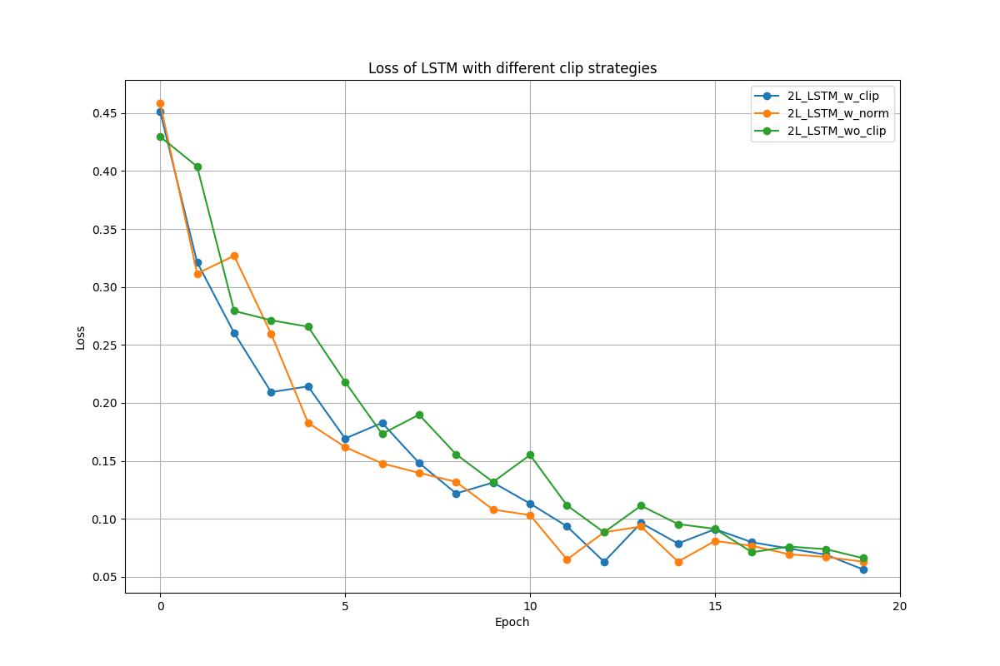

**Figure 9.** Loss of a two-layer LSTM with different learning rates.

### Effect of Varying Sample Rates

Consistent with the findings in section 2.2, increasing the training data sampling rate generally improved the validation accuracy for RNN, GRU, and LSTM models (Fig. 10-15). GRU and LSTM maintained superior generalization performance across different sample rates compared to RNN.

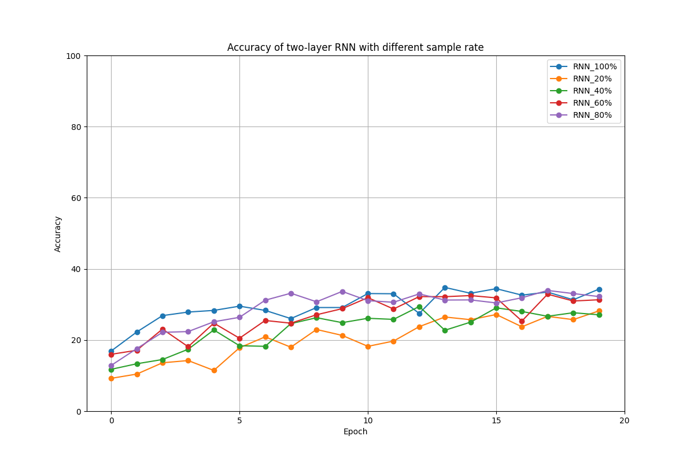

**Figure 10.** Accuracy of a two-layer RNN with different sample rates.

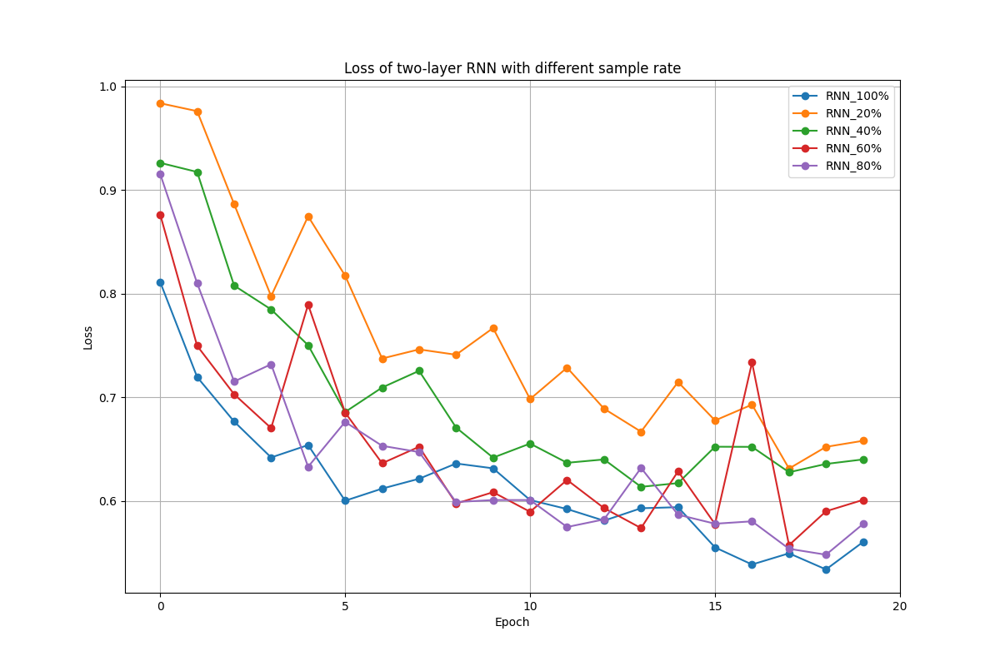

**Figure 11.** Loss of a two-layer RNN with different sample rates.

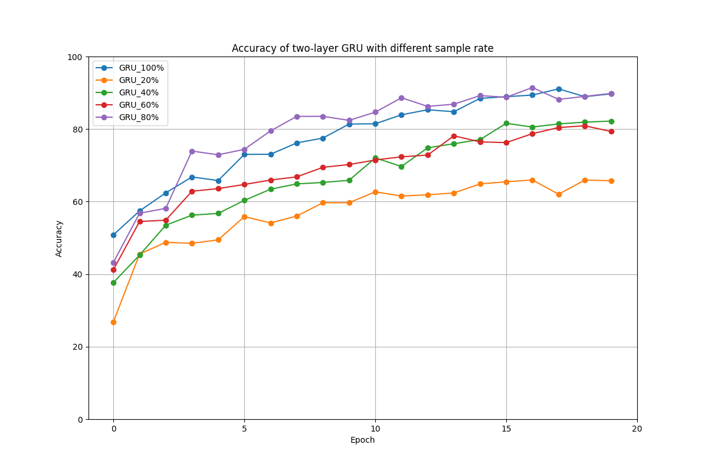

**Figure 12.** Accuracy of a two-layer GRU with different sample rates.

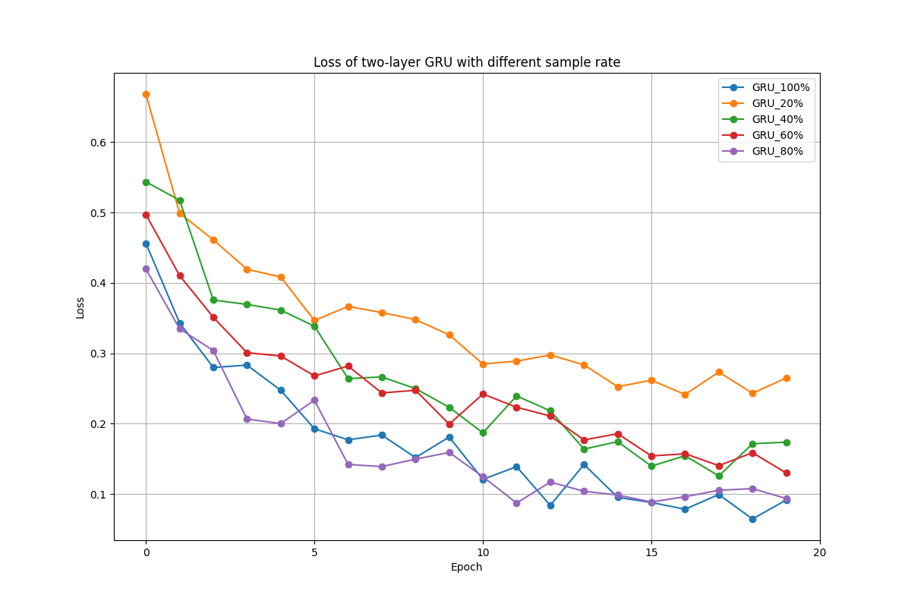

**Figure 13.** Loss of a two-layer GRU with different sample rates.

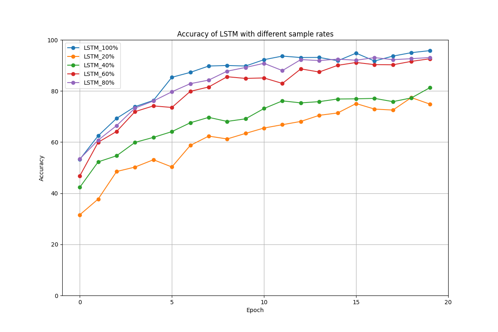

**Figure 14.** Accuracy of a two-layer LSTM with different sample rates.

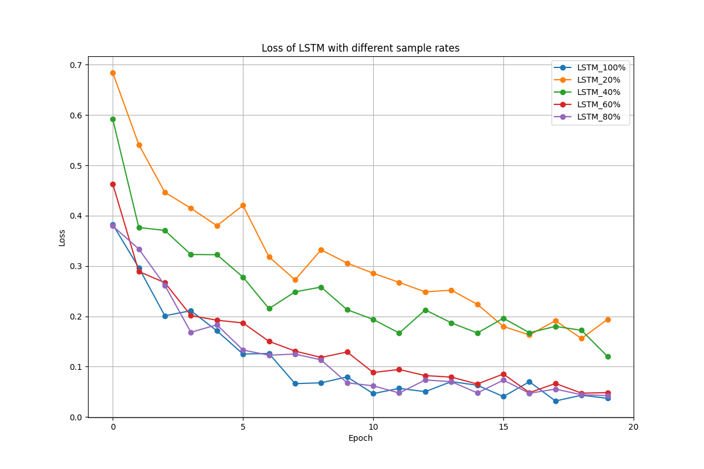

**Figure 15.** Loss of a two-layer LSTM with different sample rates.

### Impact of Increasing Hidden Dimension

Increasing the hidden dimension of a two-layer LSTM from 256 to 512 resulted in a slightly faster convergence and a higher final validation accuracy (Fig. 16 & 17), suggesting that a larger hidden state can improve the model's capacity to learn complex patterns in the arithmetic language.

**Figure 16.** Accuracy of a two-layer LSTM with different hidden dimensions.

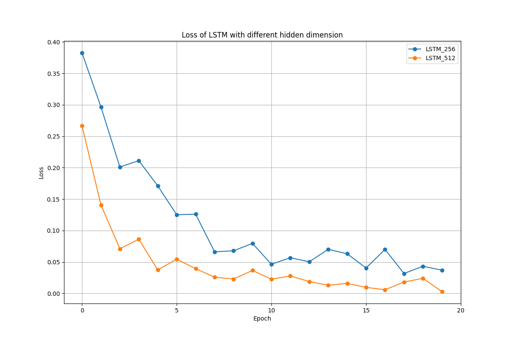

**Figure 17.** Loss of a two-layer LSTM with different hidden dimensions.

## Reference

Sample code / Data: [IKMLab Github](https://github.com/IKMLab/NTHU_Natural_Language_Processing/tree/main/Assignments/Assignment2)