# CS563100 Natural Language Processing - Assignment 3: Multi-output Learning

## Experimental Setup

**Running Environment:**
* **System:** Ubuntu 20.04.5 LTS
* **CPU:** Intel(R) Core(TM) i9-9820X CPU @ 3.30GHz
* **GPU:** RTX4080S
* **Python Version:** 3.8.10

## Experiments

### Pre-trained Model Selection

The `google-bert/bert-base-uncased` model was selected for this assignment. As shown in Figure 1, while the `cased` version exhibited slightly better validation performance across four metrics, the `uncased` version outperformed it on the test set. This suggests that case sensitivity was not a critical factor for this task, justifying the choice of the `uncased` model for subsequent experiments.

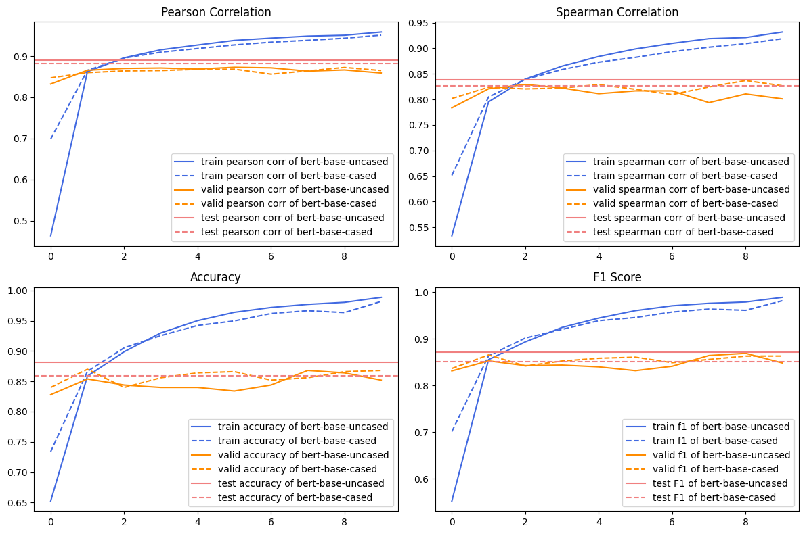

**Figure 1.** Performance difference between the cased model and uncased model.

### Comparison of Multi-output Learning vs. Separate Training

A multi-output model with BERT followed by two distinct FC blocks for each sub-task was compared against a separate training regime where each sub-task was trained independently. Figure 2 demonstrates that multi-output learning yielded superior test performance across all four metrics. This improvement indicates that sharing BERT's representations facilitated the learning of more general semantic knowledge relevant to both sub-tasks, enhancing generalization. Furthermore, the lower training phase metrics observed in multi-output learning suggest a regularization effect, mitigating overfitting. Multi-output learning also offers computational efficiency by training a single model for both tasks.

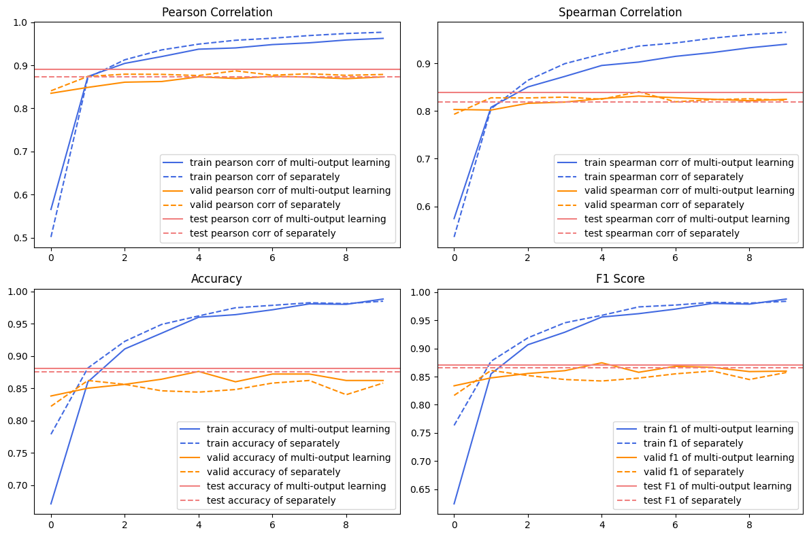

**Figure 2.** The performance difference between the multi-output learning and separate training.

### Error Analysis

**Relatedness Sub-task:** Figure 3 shows a label distribution skewed towards 1 and 3-5, while model predictions clustered around 3.5-4 and 5. Figure 5 reveals higher Mean Squared Error (MSE) in the less frequent label ranges of 1.2-3.

**Entailment Sub-task:** Figure 6 illustrates an imbalanced class distribution. Validation confusion matrices (Figure 7 & 8) suggest a model tendency to classify inputs as neutral. Attempts to address this with weighted cross-entropy loss and Focal Loss (Figure 9) did not yield significant improvements. Confusion was also observed between the neutral and entailment classes.

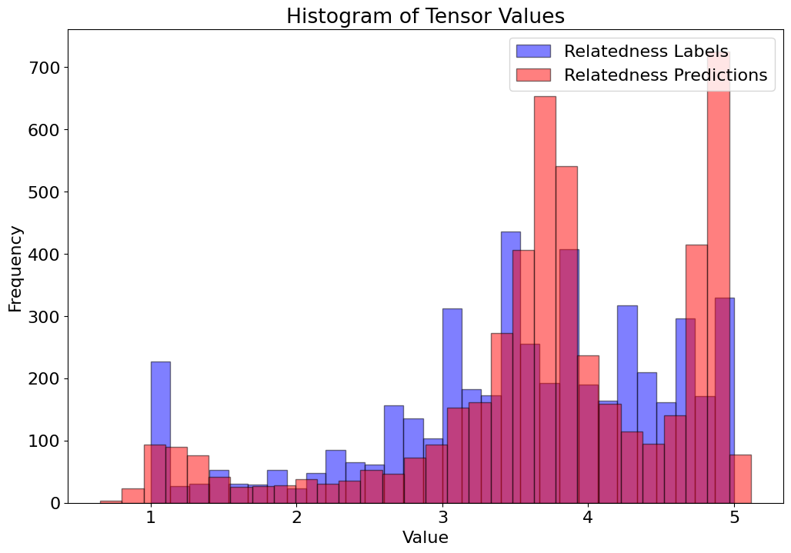

**Figure 3.** The distribution of relatedness labels and relatedness predictions.

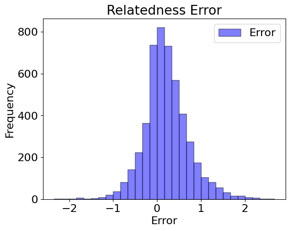

**Figure 4.** The distribution of L1 error.

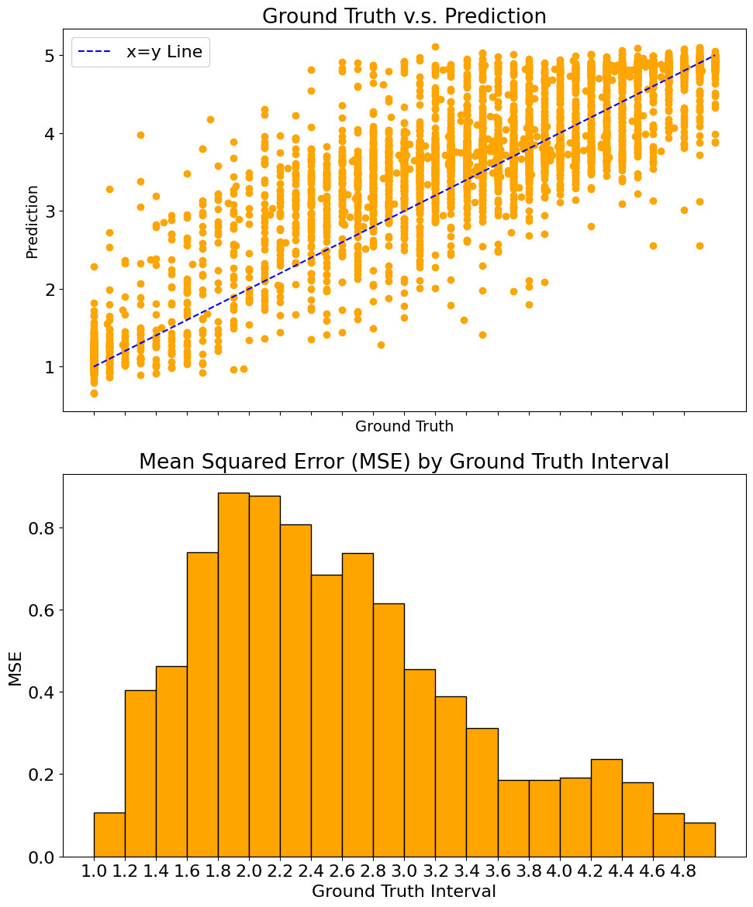

**Figure 5.** The distribution and MSE of different levels of relatedness score.

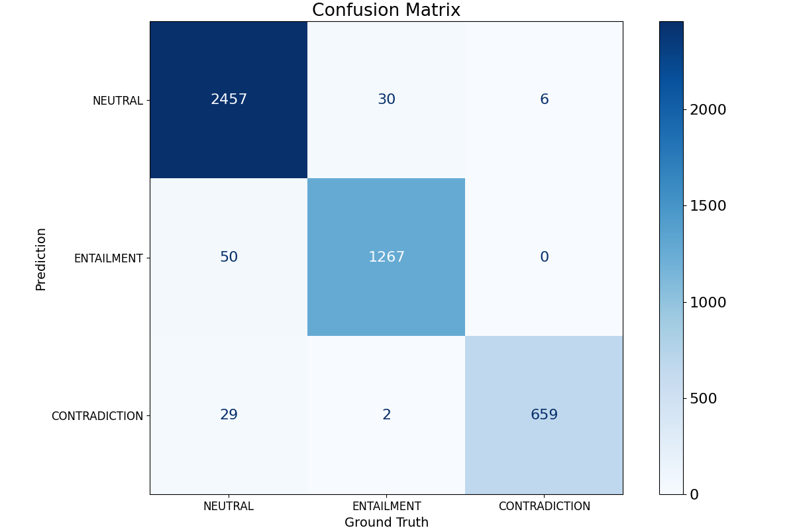

**Figure 6.** The training confusion matrix.

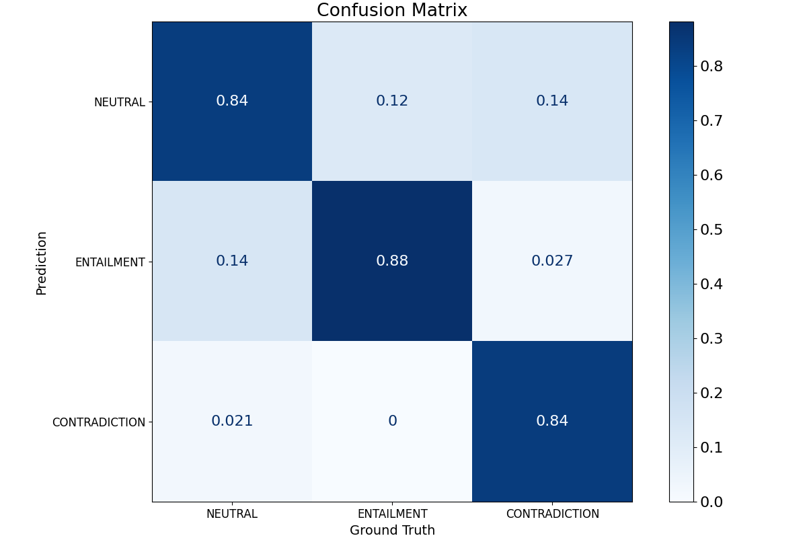

**Figure 7.** The normalized validation confusion matrix.

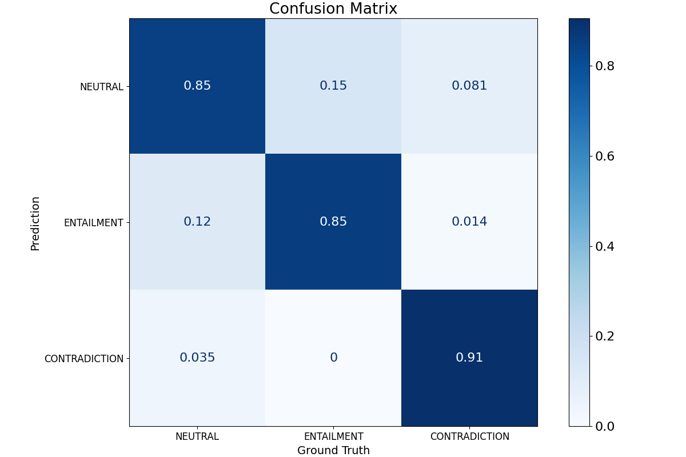

**Figure 8.** The normalized validation confusion matrix after using weighted class loss.

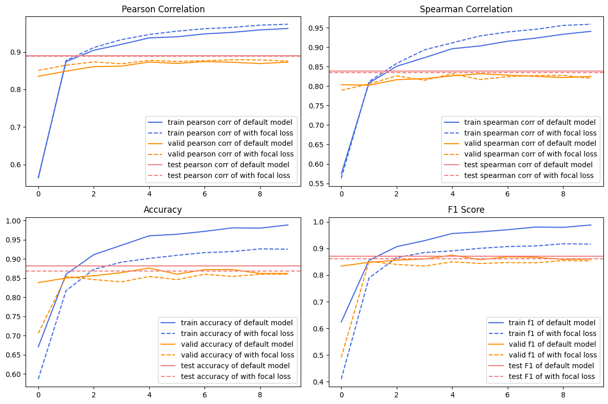

**Figure 9.** The performance after using focal loss.

### Model Improvement Attempts

Adding Dropout (rate=0.25) to the BERT output resulted in marginal improvements in the Relatedness sub-task and some overfitting reduction, but slightly worsened performance in the Entailment sub-task without significantly impacting overfitting (Figure 10). Introducing a shared FC layer after BERT before the individual sub-task outputs led to a minor improvement in Relatedness but exacerbated overfitting and significantly degraded performance in Entailment (Figure 11).

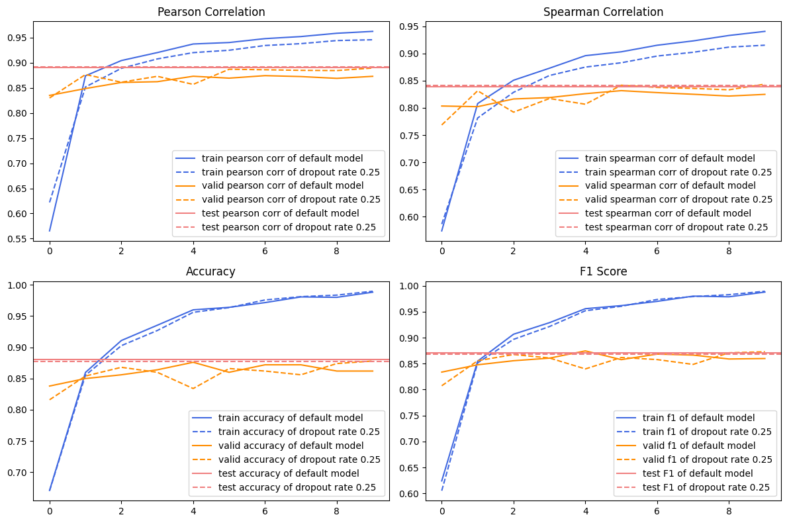

**Figure 10.** The performance difference between w/ dropout and w/o dropout.

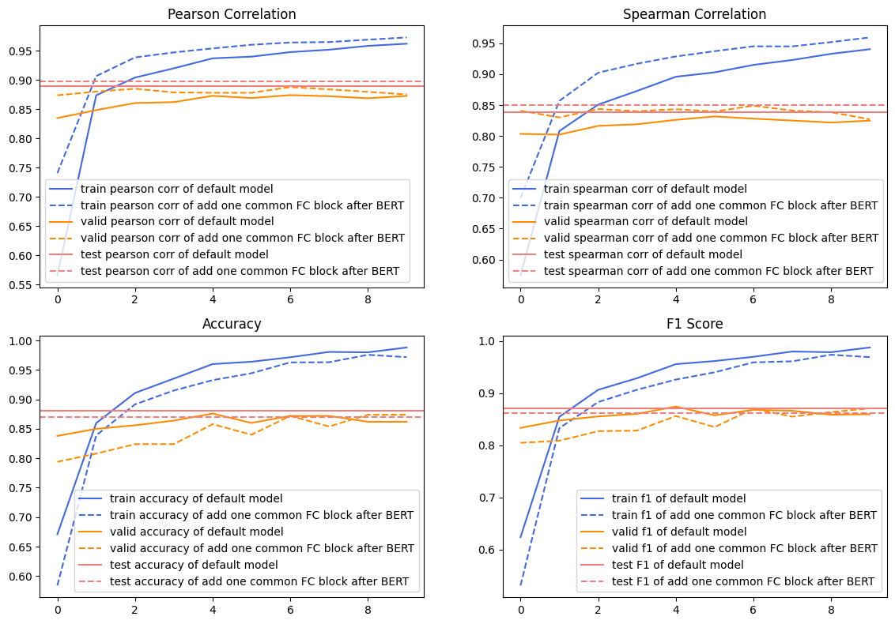

**Figure 11.** The performance of adding one common FC block after BERT.

## Summary

The best performing model utilized `google-bert/bert-base-uncased` with separate FC blocks for each sub-task, achieving a Test Spearman Correlation Coefficient of 0.8395 and a Test Accuracy of 0.8815.

## Reference

Sample code / Data: [IKMLab Github](https://github.com/IKMLab/NTHU_Natural_Language_Processing/tree/main/Assignments/Assignment3)